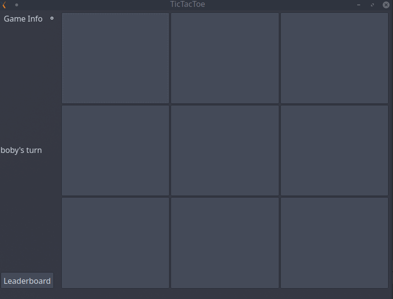
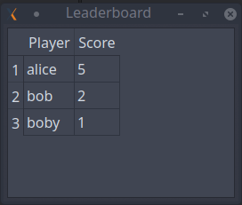

# Tic-Tac-Toe game

## Description of the program

This is a Tic-Tac-Toe game written in C++. The game has a grid of 9 fields in which the user can choose to click on in order to place a nought or cross. The winner is the player who places all three marks in the horizontal, vertical, or diagonal row. The player can use any alias to repesent him/her in the game, which has to be provided at the start of the game. The program also provides leaderboard, where users can view the best players.

## Description of the library used

The program uses SQLite library and Qt framework. Qt is a cross-platform framework. It’s used to develop applications and graphical user interfaces that can run across different operating systems. SQLite is a serverless database management system that provides data storage using a file.

## Implementation of the used library in the program

The Qt framework is used to create the user interface for the game. It was used to create the grid, fields and leaderboard visuals. The SQLite library is used to create database, and store, modify data in it. 

Program's main screen:

Program's leaderboard screen:

## Tests

The game was tested using manual testing. Each program's functions was tested using different step combinations to ensure that the game will run smoothly. Here are some steps which were used to test the game:

1. Launch the app;
2. Enter name for player "X";
3. Enter name for player "O";
4. Click on any button to make a move;
5. Let the opponent do the same;
6. Repeat steps 4 and 5 until there is a winner or its a draw.

## Bibliography

1. https://www.sqlite.org/about.html
2. https://lembergsolutions.com/blog/why-use-qt-framework
3. https://doc.qt.io/